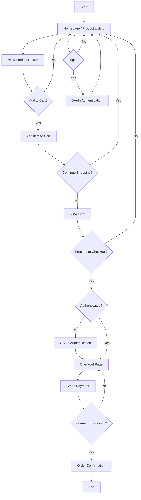

```mermaid
graph TD
    A[Start] --> B[Homepage / Product Listing]
    B --> C[View Product Details]
    C --> D{Add to Cart?}
    D -->|Yes| E[Add Item to Cart]
    D -->|No| B
    E --> F{Continue Shopping?}
    F -->|Yes| B
    F -->|No| G[View Cart]
    G --> H{Proceed to Checkout?}
    H -->|No| B
    H -->|Yes| I{Authenticated?}
    I -->|No| J[OAuth Authentication]
    J --> K[Checkout Page]
    I -->|Yes| K
    K --> L[Stripe Payment]
    L --> M{Payment Successful?}
    M -->|Yes| N[Order Confirmation]
    M -->|No| K
    N --> O[End]
    
    B --> P{Login?}
    P -->|Yes| Q[OAuth Authentication]
    Q --> B
    P -->|No| B
```
